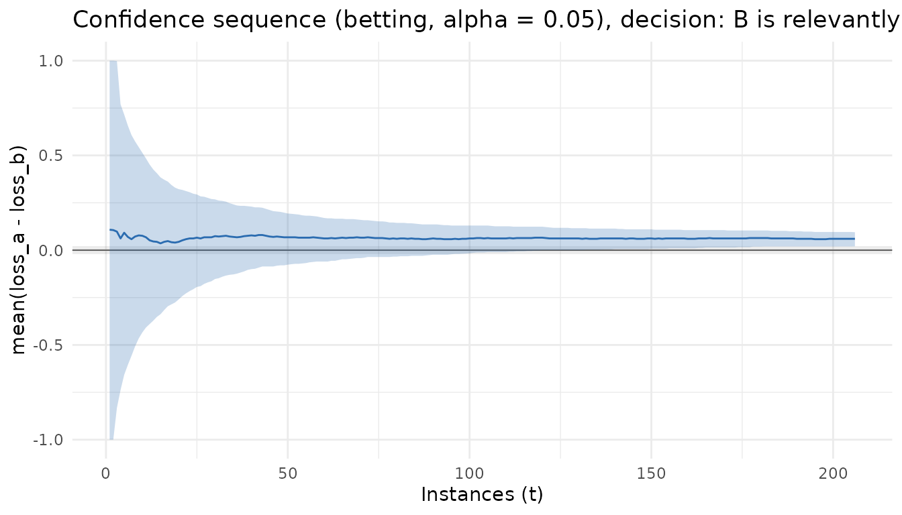

# Getting started with seqbench

`seqbench` answers one question: *when can I stop comparing algorithm A
with algorithm B without invalidating the inference?* It treats the
benchmark as a sequential experiment on **paired losses** (same
instance, same seed) and maintains a confidence sequence for the mean
paired difference that stays valid under optional stopping, repeated
inspection and adaptive budgets. A pre-registered margin of practical
equivalence `delta` turns the interval into one of three declarations,
or a decision to continue, or an inconclusive outcome when the budget
runs out.

## 1. The design comes first

Everything the procedure needs is fixed before any losses are observed:

``` r

library(seqbench)

design <- comparison_design(
  alpha   = 0.05,        # P(any false declaration, ever) <= alpha
  margin  = 0.02,        # practical-equivalence margin delta, in loss units
  bounds  = c(0, 1),     # known bounds of the losses of both algorithms
  boundary = "betting",  # Waudby-Smith & Ramdas (2024); the default
  budget  = 800,         # total cost after which the outcome is "inconclusive"
  cost_per_round = 1     # cost of one (instance, seed) evaluation of both algorithms
)
design
#> 
#> ── seqbench comparison design ──────────────────────────────────────────────────
#> • Boundary: betting
#> • alpha = 0.05, margin = 0.02 (loss units)
#> • Loss bounds: [0, 1]; paired difference in [-1, 1]
#> • Budget: 800 cost units, n_max = unlimited instances, cost per round = 1
```

The three hypotheses partition the line: A is relevantly better if
`mu < -delta`, B if `mu > delta`, and the two are practically equivalent
if `|mu| <= delta`, where `mu` is the mean of `loss_a - loss_b` over the
population of instances. The margin is a domain decision, never tuned
after looking at data.

Before collecting anything you can ask how many instances a given
distance to the threshold will need:

``` r

planning_horizon(design, distance = 0.05)             # guaranteed (Hoeffding), very conservative
#> [1] 52296
planning_horizon(design, distance = 0.05, sd = 0.10)  # variance-based approximation
#> [1] 640
```

Typical stopping times are about half of these values.

## 2. Feeding paired losses

Instances are the sequential unit. Each row is one `(instance, seed)`
pair with the losses of both algorithms; several seeds of the same
instance are averaged into a single observation. Here we simulate a
population where `loss_a - loss_b` has mean 0.05, i.e. A loses 0.05 more
than B on average, so B should be declared relevantly better:

``` r

set.seed(42)
simulate_batch <- function(instances, mu = 0.05, sd = 0.10) {
  h <- sd * sqrt(3)
  la <- runif(length(instances), 0.4, 0.8)
  data.frame(instance = instances, seed = 1L,
             loss_a = la, loss_b = la - mu + runif(length(instances), -h, h))
}

state <- initialize_comparison(design)
state <- update_comparison(state, simulate_batch(1:50))
state
#> 
#> ── seqbench comparison ─────────────────────────────────────────────────────────
#> • Boundary betting, alpha = 0.05, margin = 0.02, bounds [0, 1]
#> • Instances: 50, evaluations: 50, cost: 50 / 800
#> • Estimate of mean(loss_a - loss_b): 0.068
#> • Confidence sequence (running intersection): [-0.07653, 0.1935]
#> • Decision: continue sampling
```

Updating is incremental. Feed more instances whenever they are
available; the procedure stops at the first instance that produces a
declaration and refuses data after that, because the pre-registered
protocol ends there:

``` r

state <- update_comparison(state, simulate_batch(51:400))
#> Warning: Stopped at instance "206" (t = 206) with decision "B"; 194 later instances were
#> not consumed.
#> ℹ Under the pre-registered protocol the experiment ends here.
stopping_decision(state)
#> [1] "B"
#> attr(,"reason")
#> [1] "declaration"
```

## 3. Reading the result

[`comparison_report()`](https://castlaboratory.github.io/seqbench/reference/comparison_report.md)
(or [`summary()`](https://rdrr.io/r/base/summary.html)) returns the full
contract: estimand, estimate, current confidence sequence, the
assumptions the guarantee relies on, diagnostics, stopping reason,
resources consumed, the instances and seeds in the order observed, and
versions.

``` r

comparison_report(state)
#> 
#> ── seqbench report ─────────────────────────────────────────────────────────────
#> mu = E_P[ E_s[ loss_a(i, s) - loss_b(i, s) ] ], mean paired difference over the
#> instance population P
#> B is relevantly better (declaration)
#> 0.06; confidence sequence [0.02004, 0.09477] at alpha = 0.05, margin = 0.02
#> betting
#> 206 instances, 206 evaluations, cost 206
#> seqbench 0.1.0, R version 4.6.1 (2026-06-24)
#> Assumptions:
#> 
#> • A1: instances are i.i.d. draws from the population P
#> 
#> • A2: the number of seeds per instance is fixed before its losses are observed
#> 
#> • A3: both losses lie in [0, 1]
#> 
#> • A4: no instance is reused after its losses are observed
```

The trajectory is a tibble, one row per instance:

``` r

tidy(state)[c(1:3, nrow(tidy(state))), ]
#> # A tibble: 4 × 12
#>       t instance n_seeds     x estimate   lower  upper lower_running
#>   <int> <chr>      <int> <dbl>    <dbl>   <dbl>  <dbl>         <dbl>
#> 1     1 1              1 0.554   0.108  -1      1            -1     
#> 2     2 2              1 0.552   0.106  -1      1            -1     
#> 3     3 3              1 0.543   0.0980 -0.832  0.998        -0.832 
#> 4   206 206            1 0.529   0.0600  0.0200 0.0948        0.0200
#> # ℹ 4 more variables: upper_running <dbl>, cost <dbl>, cost_cum <dbl>,
#> #   decision <chr>
glance(state)
#> # A tibble: 1 × 12
#>   boundary valid alpha margin n_instances n_evaluations  cost estimate  lower
#>   <chr>    <lgl> <dbl>  <dbl>       <int>         <int> <dbl>    <dbl>  <dbl>
#> 1 betting  TRUE   0.05   0.02         206           206   206   0.0600 0.0200
#> # ℹ 3 more variables: upper <dbl>, decision <chr>, stopping_reason <chr>
```

and the confidence sequence can be plotted against the number of
instances, with the equivalence band:

``` r

ggplot2::autoplot(state)
```



## 4. What the package refuses

The guarantee rests on four assumptions, and the package will not
silently convert a violation into a valid-looking result:

``` r

fresh <- initialize_comparison(design)
update_comparison(fresh, data.frame(instance = 1, loss_a = 1.2, loss_b = 0.5))   # outside bounds
#> Error in `update_comparison()`:
#> ! 1 value of loss_a falls outside the declared bounds [0, 1] (row 1).
#> ℹ Losses are never clipped. Fix the data or declare wider bounds in
#>   `comparison_design()`.
update_comparison(fresh, data.frame(instance = 1, loss_a = NA,  loss_b = 0.5))   # missing
#> Error in `update_comparison()`:
#> ! Column loss_a must be numeric.
```

Adding new seeds to an instance whose losses have already been seen is
adaptive reuse, not i.i.d. sampling, so it is an error too; plan all
seeds of an instance before observing any of them. Unpaired designs
(`paired = FALSE`) are not implemented and say so.

## 5. Inconclusive is an outcome

When the budget ends before a declaration, the result is
`"inconclusive"`, reported with the final interval and the reason. It is
never turned into a decision:

``` r

tight <- comparison_design(alpha = 0.05, margin = 0.02, bounds = c(0, 1), n_max = 30)
st <- update_comparison(initialize_comparison(tight), simulate_batch(1:30, mu = 0.03))
stopping_decision(st)
#> [1] "inconclusive"
#> attr(,"reason")
#> [1] "n_max"
```

## 6. Boundaries

| boundary | source | use |
|----|----|----|
| `"betting"` | hedged capital process, Waudby-Smith & Ramdas (2024) | default; tightest in the package’s experiments |
| `"empirical_bernstein"` | predictable-plug-in empirical Bernstein, same source | conservative reference |
| `"hoeffding"` | predictable-plug-in Hoeffding, same source | distribution-free reference; very conservative |
| `"naive_fixed"` | fixed-sample t interval recomputed at every step | **invalid**; negative control for experiments only |

All three valid boundaries assume bounded losses, i.i.d. instances,
seeds fixed before their losses are seen, and no instance reuse.
`naive_fixed` carries a `valid = FALSE` flag in every output.
