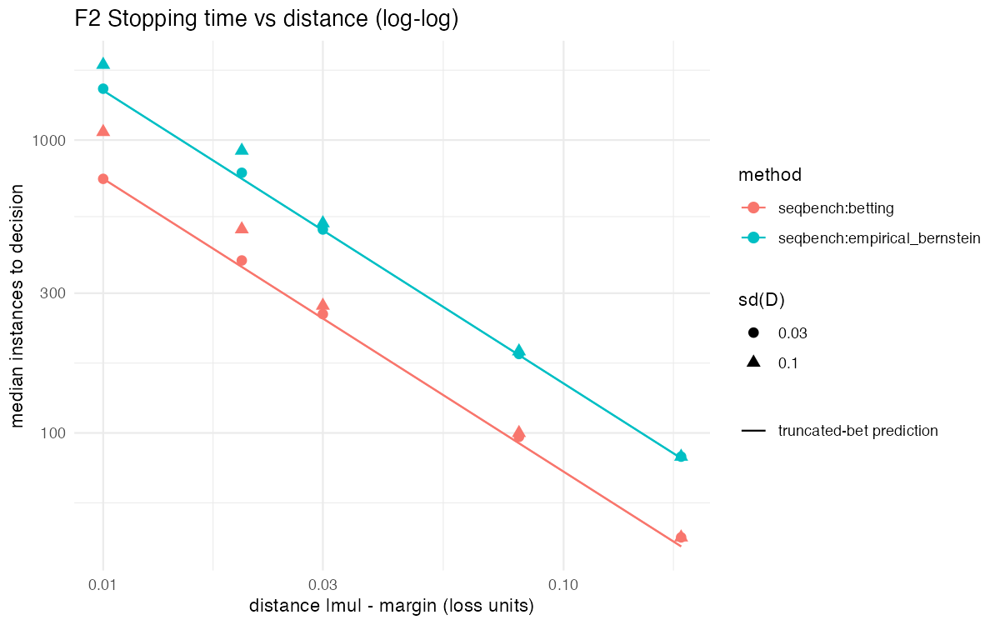

```{r setup, include=FALSE}
knitr::opts_chunk$set(echo = FALSE, warning = FALSE, message = FALSE)
library(seqbench)
```


# Introduction {#sec-intro}

Algorithm comparisons in optimisation, machine learning and computational statistics are
rarely fixed-sample experiments. Instances are run in batches; intermediate results are
inspected; more seeds are added where the outcome looks close; the study stops when one
method "clearly" dominates or when the budget runs out. Every one of these habits invalidates
a fixed-sample test: inspecting a $t$-test after each instance and stopping at the first
rejection inflates the type-I error without bound (@armitage1969), and
the simulation study in Section 5 measures it at 38% for a nominal 5% in one of our
scenarios. The problem is old and well understood in clinical trials; the benchmarking
literature mostly ignores it. Best-practice guides recommend statistical tests
(@bartz2020; @eimer2025) but not sequential ones; racing methods
used in algorithm configuration (@birattari2002; @lopezibanez2016) inspect
repeatedly by design and explicitly disclaim error control.

The statistical tool that fixes this is the confidence sequence (@howard2021; @ramdas2023): a sequence of intervals $C_t$ with
$P(\forall t: \mu \in C_t) \ge 1-\alpha$, valid at every data-dependent stopping time.
@waudbysmith2024 give tight confidence sequences for the mean of bounded
random variables by betting; @choe2024 apply confidence sequences to the
paired comparison of two forecasters; the R packages \CRANpkg{safestats} [@safestats; @ly2024] and
\CRANpkg{seqcomp} [@seqcomp] implement sequential $t$-tests and forecast comparisons respectively.

`seqbench` packages this machinery into a *protocol for algorithm benchmarking*. Its
contributions are practical, not methodological: an explicit population estimand for the
comparison, pairing by instance with seeds treated as a cluster, a pre-registered margin
of practical equivalence turned into a three-way decision rule that inherits the error
control of the confidence sequence, cost accounting with an inconclusive outcome that is
never converted into a decision, and a result contract that reports what was assumed and
what was consumed. We are explicit about what this does *not* buy: the error control is a
margin rule applied to an existing confidence sequence, and, as Section 5 shows, the
distribution-free boundaries pay a substantial price in instances relative to a Gaussian
sequence that knows the variance. The package makes that price visible instead of hiding
it.

Section 2 states the problem and the assumptions; Section 3 the protocol and its guarantee; Section 4 the package; Section 5 the simulation study; Section 6 three applications; Section 7 discusses limitations and the road ahead.

# The comparison as a sequential experiment {#sec-setting}

## Estimand

Let $P$ be a population of problem instances and $S$ a distribution of seeds (random
restarts, initialisations, resampling). Running algorithm $k \in \{A, B\}$ on instance $i$
with seed $s$ yields a loss $L_k(i, s)$, smaller being better; the loss is the user's
choice and the package does not interpret it. The paired difference is
$D(i, s) = L_A(i, s) - L_B(i, s)$ and the estimand is the population mean

$$\mu = E_{i \sim P}\big[E_{s \sim S}[D(i, s)]\big].$$

A negative $\mu$ favours A. This is what "A is better than B on problems like these"
means. It is *not* the mean over a fixed benchmark set (a finite-population target, for
which sequential inference would sample without replacement), nor a probability of
winning; both are legitimate targets and neither is the one addressed here.

## Practical relevance

A margin $\delta > 0$, in loss units, is fixed before any data are seen and partitions the
parameter space into three hypotheses that cover the line (Table \@ref(tab:tab1)).

```{r tab1}
tab <- as.data.frame(rbind(
  c("$H_A$", "$\\mu < -\\delta$", "A is relevantly better"),
  c("$H_0$", "$|\\mu| \\le \\delta$", "practically equivalent"),
  c("$H_B$", "$\\mu > \\delta$", "B is relevantly better")
), stringsAsFactors = FALSE)
names(tab) <- c("Hypothesis", "Condition", "Reading")
knitr::kable(tab, caption = "The three hypotheses defined by the margin.", escape = FALSE, row.names = FALSE, booktabs = TRUE) |>
  kableExtra::kable_styling(latex_options = "hold_position")
```


The margin is a domain decision (one percentage point of accuracy, 0.1 points of
optimality gap, one modularity point), recorded with the design and never tuned after
inspection. This is the reading of a confidence interval used by equivalence testing
[@schuirmann1987; @lakens2017] and by Bayesian regions of practical equivalence
[@benavoli2017], made anytime-valid.

## Assumptions

- **(A1) Independent instances.** Instances are drawn i.i.d. from $P$.
- **(A2) Seeds fixed by design.** The number of seeds for an instance and their values
  are chosen without looking at any loss of that instance; seeds are drawn from $S$.
- **(A3) Bounded losses.** Both losses lie in a known interval $[\ell_{lo}, \ell_{hi}]$,
  so $D \in [a, b] = [\ell_{lo} - \ell_{hi}, \ell_{hi} - \ell_{lo}]$.
- **(A4) No adaptive reuse.** A draw whose losses were observed does not receive new seeds
  and does not reappear.

Under (A1)–(A3) the per-instance seed-averaged difference, rescaled to
$X_t = (\bar D_{i_t} - a)/(b - a) \in [0, 1]$, satisfies $E[X_t \mid \mathcal F_{t-1}] = \nu$
with $\nu = 1/2 + \mu/(b-a)$, which is what the confidence sequences below require;
the $X_t$ need not be identically distributed (the seed count may vary), and arbitrary
dependence between the two algorithms and across seeds of the same instance is allowed.
(A4) is what makes (A2) enforceable: adding seeds to an instance after seeing its losses
makes $X_t$ depend on past outcomes. The sequential unit is therefore the instance, not the
evaluation.

Timeouts and failed runs are handled before the data reach the package: a penalised
outcome [PAR-$k$: the cutoff time times $k$ for unfinished runs, @hutter2009] keeps
the loss bounded and changes the estimand to the mean penalised loss; censoring would keep
the estimand and break boundedness. The package takes the first route and records the
choice as the user's.

# The protocol and its guarantee {#sec-protocol}

## Confidence sequences for bounded means

On the $[0, 1]$ scale the package offers three confidence sequences from @waudbysmith2024, all with the time-uniform guarantee under the conditional-mean condition
above: the predictable-plug-in Hoeffding sequence (a deterministic width, distribution-free
and very conservative), the predictable-plug-in empirical-Bernstein sequence (variance
adaptive) and the hedged betting sequence (the default, the tightest of the three). A fourth
option, `"naive_fixed"`, is the fixed-sample $t$ interval recomputed at every instance; it is
*not* a confidence sequence, is flagged invalid in every output, and exists only as the
negative control of Section 5. Since every set of one confidence sequence contains $\nu$ on
the same event, the running intersection $C_t^\cap = \bigcap_{s \le t} C_s$ is again a
$1-\alpha$ confidence sequence, and the decision rules use it.

## Decision rule

With $C_t^\cap = [L_t, U_t]$ mapped back to loss units, checked in this order:

1. inconclusive with reason `cs_empty` if $U_t < L_t$ (possible with probability at most
   $\alpha$; never a decision);
2. A is relevantly better if $U_t < -\delta$;
3. B is relevantly better if $L_t > \delta$;
4. practically equivalent if $-\delta \le L_t$ and $U_t \le \delta$;
5. otherwise continue, unless the budget or the maximum number of instances is exhausted,
   in which case the outcome is inconclusive with reason `budget` or `n_max`.

**Proposition (no false declaration, single $\alpha$).** Let $C_t$ be a $1-\alpha$
confidence sequence for $\nu$. For every stopping time $\tau$, including budget-driven ones,
the probability that the procedure ever issues a false declaration, of any of the three
kinds, is at most $\alpha$.

*Proof.* On the event $E = \{\forall t: \nu \in C_t\}$, which has probability at least
$1-\alpha$, $L_t \le \nu \le U_t$ for all $t$; each declaration condition then implies the
corresponding hypothesis, so every declaration on $E$ is correct, at every $t$ and in
particular at $\tau$. The three false-declaration events are disjoint and contained in
$E^c$. $\square$

The proof is one paragraph because the work is done by the confidence sequence. What the
protocol adds is the reading: the three declarations are events on one simultaneous
confidence set, so no split of $\alpha$ is needed (TOST needs none either; it is an
intersection–union test), and the guarantee holds at the data-dependent time at which a
benchmarker actually stops. "Inconclusive" carries no error; it is the complement of a
declaration, and its probability is a design quantity.

## Planning

For the Hoeffding sequence the half-width $w_t$ is deterministic, and on the coverage
event the correct declaration has been issued by
$t^*(g) = \min\{t : 2 w_t < g\}$, where $g$ is the distance from $\nu$ to the nearest
threshold on the $[0,1]$ scale. This is computable before any data are collected from
$(\alpha, \delta, \text{bounds})$ and a target distance, and it is what
`planning_horizon()` returns; a variance-based approximation using the empirical-Bernstein
width with a declared standard deviation is available as well. Both are conservative:
typical stopping times are one half (Bernstein) to one quarter (betting) of the returned
value in the regimes of Section 5, whose last part explains why.

# The package {#sec-package}

## Workflow

```{r workflow, echo = TRUE, eval = TRUE}
library(seqbench)
set.seed(1)
design <- comparison_design(alpha = 0.05, margin = 0.02, bounds = c(0, 1),
                            boundary = "betting", budget = 800)
state  <- initialize_comparison(design)

losses <- data.frame(instance = 1:50, seed = 1L,
                     loss_a = runif(50, 0.4, 0.8), loss_b = runif(50, 0.3, 0.7))
state  <- update_comparison(state, losses)   # one row per (instance, seed)
stopping_decision(state)
```

```{r workflow2, echo = TRUE, eval = TRUE}
glance(state)
```

`update_comparison()` is incremental: rows of new instances can be fed at any time, in any
batch size; seeds of the same instance are averaged into one observation; the procedure
stops at the first instance that triggers a declaration and refuses data after that
(the pre-registered protocol ends there), with a warning listing what was not consumed.
`comparison_report()` (also `summary()`) returns the full result contract, `tidy()` the
trajectory (one row per instance with the interval, its running intersection, cost and the
decision at that time), `glance()` a one-row summary, and `autoplot()` the confidence
sequence against the number of instances with the equivalence band.

## The result contract

Every comparison reports: the estimand (as a sentence), the estimate, the current
confidence sequence, the boundary and its validity flag, the four assumptions in words, the
decision and stopping reason, diagnostics (instances, evaluations, losses at the bounds,
empty-set flag), resources consumed against the budget, the instance and seed identifiers
in the order observed, and the package and R versions. The intent is that a reader can
audit a decision without rerunning it.

## Refusals

The package never converts invalid input into a valid-looking result. A loss outside the
declared bounds is an error, not a clipped value; a missing loss is an error, not a dropped
row; a negative or infinite cost is an error; a duplicated (instance, seed) pair is an
error; an instance that reappears after its losses were observed is an error with a message
explaining (A4); `paired = FALSE` is an error saying that unpaired designs are not
implemented. Updating after a terminal decision is an error too.

## Implementation notes

Each boundary is a small state machine with sufficient statistics, exposed through three
kernels that sister packages can reuse: `boundary_init()` creates the state,
`boundary_update()` absorbs one observation and `boundary_interval()` reads the current
confidence set. The
betting boundary keeps the log-capital on a grid of candidate means; its confidence set is
the set of grid points whose capital is below $1/\alpha$, which @waudbysmith2024 prove
to be an interval. The package reports the *outer* boundaries of the accepted run (so that
the reported set contains the exact one) and refines an endpoint by bisection on the exact
capital only when its grid cell contains a decision threshold, which is the only case in
which refinement can change a decision; a nonempty set narrower than one grid cell is found
by minimising the exact capital rather than reported as empty. The per-instance cost is
linear in the grid size away from thresholds; a stream of 2,000 instances that never
decides takes 0.3 s.

# Simulation study {#sec-sim}

## Design

The study was frozen before results were available (configuration files are dated and
never edited; changes are new files) and its analysis script was written and tested on a
three-replication smoke run before the study ran. All code is in `experiments/` of the
package repository.^[<https://github.com/castlaboratory/seqbench>, outside the R package
sources.] Losses are generated as $\text{loss}_A = u_i + \eta_{is}$ and
$\text{loss}_B = u_i' + \eta'_{is} - \mu + e_{is}$ with an instance effect
$u_i \sim U(0.45, 0.70)$ shared by both algorithms when paired ($u_i' = u_i$) and drawn
independently otherwise, seed noise $\eta \sim U(-h_{seed}, h_{seed})$ and comparison noise
$e \sim U(-h, h)$; then $E[\text{loss}_A - \text{loss}_B] = \mu$ exactly, all losses lie in
$[0.05, 0.90] \subset [0, 1]$, and the standard deviation of the per-instance difference is
known. The baseline grid crosses $\mu \in \{0, 0.01, 0.02, 0.05, 0.10, 0.20\}$ (null, true
equivalence, exactly at the margin, moderate, large, very large effects) with
$\text{sd}(D) \in \{0.03, 0.10\}$, with $\alpha = 0.05$, $\delta = 0.02$, bounds $[0, 1]$
and a budget of 2,000 instances. Two ablations use the high-noise level: unpaired
instances, and five seeds per instance with seed noise 0.03. Each of the 24 cells has
2,000 replications; every method sees the same simulated stream in a given replication
(seeded by cell and replication only), so method comparisons are paired. Two amendments,
frozen on 2026-09-26 after an external review and run with the same methods and
replication count, add 14 cells with negative effects and effects 0.005 and 0.01 away from
the margin ($\mu \in \{-0.20, -0.05, -0.025, -0.015, 0.015, 0.025, 0.03\}$, both noise
levels) and 12 seed-cluster cells with an instance-specific differential effect (Section
5.4). One amended cell ($\mu = -0.20$, high noise) is invalid by construction: its losses
for B reach 1.07, and the package refused every replication of it rather than clip; it is
reported as such and excluded, since the other 13 cells cover the negative direction.

Eight procedures are compared: the three valid boundaries and the invalid control;
fixed-sample $t$ intervals at $n = 100$, $500$ and $2{,}000$ instances with the same
three-way margin rule (no adaptation); and the anytime-valid confidence sequence for the
mean of `safestats`' sequential $t$-test [`saviTTest`, @safestats; @ly2024] with the same running
intersection and margin rule, its design fixed before the stream with the *known*
standard deviation of the data-generating process (an oracle, favourable to `safestats`,
which assumes Gaussian data while ours are sums of uniforms).

Metrics: false declarations (a declaration that contradicts the truth; at $\mu = \delta$
the truth is "equivalent"), coverage failure (the true mean leaves the reported running
intersection at some time up to stopping), inconclusive outcomes, and instances consumed.
Uncertainty: Wilson intervals for rates; percentile bootstrap over replications for
medians; paired bootstrap for ratios of medians. With 2,000 replications the Monte Carlo
standard error of a rate near 0.05 is 0.005; zero observed events give an upper Wilson
bound of 0.0019.

## Validity

Table \@ref(tab:tab2) gives, for each procedure, the largest false-declaration rate and the largest
coverage-failure rate over the 24 cells.


```{r tab2}
tab <- as.data.frame(rbind(
  c("betting", "0.0045 ($\\mu = 0.02$, unpaired) [0.0024, 0.0085]", "0.0145"),
  c("empirical Bernstein", "0.0015 ($\\mu = 0.02$, unpaired) [0.0005, 0.0044]", "0.0025"),
  c("Hoeffding", "0.0000 [0, 0.0019]", "0.0000"),
  c("fixed $n = 100$", "0.0310 ($\\mu = 0.02$) [0.0243, 0.0395]", "0.0610"),
  c("fixed $n = 500$", "0.0270 ($\\mu = 0.02$) [0.0208, 0.0351]", "0.0560"),
  c("fixed $n = 2000$", "0.0355 ($\\mu = 0.02$, unpaired) [0.0282, 0.0445]", "0.0640"),
  c("`safestats` CS, oracle sd", "0.0250 ($\\mu = 0.02$) [0.0190, 0.0328]", "0.0495"),
  c("naive fixed (invalid)", "0.3800 ($\\mu = 0.02$) [0.3590, 0.4015]", "0.6195")
), stringsAsFactors = FALSE)
names(tab) <- c("Procedure", "max false declaration", "max coverage failure")
knitr::kable(tab, caption = "Maximum rates over 24 cells (2,000 replications each), with the cell and the 95\\% Wilson interval of the maximum false-declaration rate.", escape = FALSE, row.names = FALSE, booktabs = TRUE) |>
  kableExtra::kable_styling(latex_options = "hold_position", font_size = 8)
```

The three distribution-free boundaries are far inside their nominal level, with their few
false declarations concentrated at the exact margin, where "equivalent" is the only correct
answer and a superiority declaration is a legitimate $\alpha$-event. Fixed-sample tests and
the Gaussian sequence sit at their nominal level. The repeatedly inspected $t$-test issues a
false declaration in 38% of the runs at the margin, 20% under true equivalence and 17%
under the null, and its interval fails to cover the truth at some inspection in up to 62%
of runs: this is the behaviour of a benchmark that peeks. Ten of its 24 cells have a Wilson
lower bound above $\alpha$.

## Cost


```{r tab3}
t2 <- read.csv("data/T2_cost.csv")
t2 <- t2[t2$ablation == "none" & t2$h > 0.1, ]
lab <- c("seqbench:betting" = "betting", "seqbench:empirical_bernstein" = "empirical Bernstein",
         "seqbench:hoeffding" = "Hoeffding", "fixed:100" = "fixed $n = 100$", "fixed:500" = "fixed $n = 500$",
         "fixed:final" = "fixed $n = 2000$", "savi_cs" = "\\CRANpkg{safestats} CS, oracle sd",
         "seqbench:naive_fixed" = "naive fixed (invalid)")
cell <- function(m, p) ifelse(p >= 0.9, "budget", ifelse(p > 0.005, sprintf("%.0f$^{%.0f\\%%}$", m, 100 * p), sprintf("%.0f", m)))
w <- reshape(data.frame(method = t2$method, mu = t2$mu, v = cell(t2$median_n, t2$p_inconclusive)),
             idvar = "method", timevar = "mu", direction = "wide")
w <- w[match(names(lab), w$method), ]
w$method <- lab[w$method]
names(w) <- c("Procedure", paste0("$\\mu = ", sort(unique(t2$mu)), "$"))
knitr::kable(w, caption = "Median instances to stopping, baseline cells with $\\text{sd}(D) = 0.10$, 2,000 replications. A superscript gives the percentage of inconclusive runs when above 0.5\\%; ``budget'' marks cells where more than 90\\% of the runs exhausted the 2,000 instances. Bootstrap 95\\% intervals of the medians are within 4\\% of the reported value in every cell.",
             escape = FALSE, row.names = FALSE, booktabs = TRUE, align = c("l", rep("r", 6))) |>
  kableExtra::kable_styling(latex_options = "hold_position", font_size = 8)
```

Three readings. First, adaptation pays: the betting sequence resolves the null in a median
of 496 instances and the moderate effect in 272, while a fixed sample of 100 is
inconclusive 96% of the time under the null and a fixed sample of 500 is inconclusive 40%
of the time at $\mu = 0.01$. Second, the ordering of the distribution-free boundaries is the
expected one: empirical Bernstein needs about 1.9 times the instances of betting, and
Hoeffding resolves only the very large effect within the budget. Third, and this is the
number a benchmarker should see before choosing: the Gaussian sequence with a known variance
needs between 0.27 and 0.71 of the instances of the betting sequence in this noise level,
and between 0.05 and 0.14 in the low-noise level (Table \@ref(tab:tab4)), with paired bootstrap intervals
of width below 0.03. The end of Section 5 explains the mechanism; Section 7 draws the consequence.


```{r tab4}
t2 <- read.csv("data/T2_cost.csv")
r <- t2[t2$ablation == "none" & t2$method == "savi_cs" & t2$mu != 0.02, ]
r <- r[order(r$h, r$mu), ]
cell <- sprintf("%.3f (%.3f--%.3f)", r$ratio_to_betting, r$ratio_lo, r$ratio_hi)
w <- data.frame(sd = ifelse(r$h < 0.1, "0.03", "0.10"), mu = r$mu, v = cell)
w <- reshape(w, idvar = "sd", timevar = "mu", direction = "wide")
names(w) <- c("$\\text{sd}(D)$", paste0("$\\mu = ", sort(unique(r$mu)), "$"))
knitr::kable(w, caption = "Ratio of median instances, \\CRANpkg{safestats} CS over betting, with the paired bootstrap 95\\% interval, baseline cells.",
             escape = FALSE, row.names = FALSE, booktabs = TRUE, align = c("l", rep("r", 5))) |>
  kableExtra::kable_styling(latex_options = c("hold_position", "scale_down"))
```

## Pairing and seed clusters


```{r tab5}
tab <- as.data.frame(rbind(
  c("unpaired, instances", "1.46", "1.79", "1.09", "1.01", "1.02"),
  c("unpaired, evaluations", "1.55", "1.36", "1.15", "1.03", "1.02"),
  c("five seeds, instances", "0.82", "0.72", "0.94", "0.97", "1.00"),
  c("five seeds, evaluations", "3.92", "3.36", "4.66", "4.85", "4.95")
), stringsAsFactors = FALSE)
names(tab) <- c("Ablation", "$\\mu = 0$", "$0.01$", "$0.05$", "$0.10$", "$0.20$")
knitr::kable(tab, caption = "Betting boundary, $\\text{sd}(D) = 0.10$: ratio of median instances and of mean evaluations (both algorithms, all seeds) relative to the paired single-seed design.", escape = FALSE, row.names = FALSE, booktabs = TRUE) |>
  kableExtra::kable_styling(latex_options = "hold_position", font_size = 8)
```

Pairing by instance costs nothing and saves up to 44% of the instances in the hard cells
(and it turns a 47% inconclusive rate at $\mu = 0.01$ into 10%). Averaging five seeds per
instance saves up to 28% of the *instances* but costs 3.4 to 5 times the *evaluations*: in
this design the instance effect cancels exactly under pairing, so seed averaging only reduces
independent seed noise, and its benefit is confined to the cells where the variance matters
at all (see the truncated-bet regime below).

The companion cluster study adds to the paired difference an instance-specific term
$v_i \sim U(-w, w)$ shared by all seeds of instance $i$, so that within-instance
differences are positively correlated and row-level analysis is genuinely invalid; with
$w = 0.05$ the intra-instance correlation is 0.07 and the design effect of five seeds is
1.3. Table \@ref(tab:tab7) compares the correct analysis (one sequential unit per
instance) with pseudoreplication (every (instance, seed) row fed as its own instance).

```{r tab7}
t8 <- read.csv("data/T8_cluster_v2.csv")
t8 <- t8[t8$w > 0 & !(t8$method == "pseudorep:betting" & t8$seeds == 1L), ]   # one-seed pseudoreplication is the one-seed analysis
lab <- c("seqbench:betting" = "betting", "pseudorep:betting" = "betting, pseudoreplication",
         "seqbench:empirical_bernstein" = "empirical Bernstein", "fixed:final" = "fixed $n = 2000$")
t8$inst <- ifelse(t8$method == "pseudorep:betting", t8$median_n / t8$seeds, t8$median_n)
cell <- function(n, ev, p) paste0(sprintf("%.0f", n), ifelse(p > 0.005, sprintf("$^{%.0f\\%%}$", 100 * p), ""), " (", sprintf("%.0f", ev), ")")
t8$v <- cell(t8$inst, t8$mean_cost, t8$p_inconclusive)
w <- reshape(t8[, c("method", "seeds", "mu", "v")], idvar = c("method", "seeds"), timevar = "mu", direction = "wide")
mc <- aggregate(miscover_rate ~ method + seeds, t8, max); names(mc)[3] <- "cov"
w <- merge(w, mc)
w <- w[order(match(w$method, names(lab)), w$seeds), ]
w$method <- lab[w$method]
w$cov <- sprintf("%.2f\\%%", 100 * w$cov)
names(w) <- c("Procedure", "Seeds", paste0("$\\mu = ", sort(unique(t8$mu)), "$"), "Max. cov. failure")
knitr::kable(w, caption = "Seed clusters with an instance-specific differential effect ($w = 0.05$, $\\text{sd}(D) = 0.10$ per row), 2,000 replications: median instances to stopping (mean evaluations of both algorithms in parentheses; a superscript gives the percentage of inconclusive runs when above 0.5\\%) and the largest coverage-failure rate over the three effect sizes. For pseudoreplication the instances are the rows divided by five.",
             escape = FALSE, row.names = FALSE, booktabs = TRUE, align = c("l", "c", rep("r", 4))) |>
  kableExtra::kable_styling(latex_options = c("hold_position", "scale_down"))
```

The result is a negative one that the paper reports as measured. Pseudoreplication did not
produce a false declaration in 12,000 runs, and its coverage failure rose only from 0.3%
(one seed) to 1.2% ($\mu = 0.01$, five seeds), four times higher but still under the
nominal 5%: a design effect of 1.3 is absorbed by the slack of the betting boundary
documented in Section 5.6. Its cost equals that of a single-seed analysis, because it
consumes the same rows under another label. The correct five-seed analysis saves 5 to 30%
of the *instances* against one seed and costs 3.3 to 4.7 times the *evaluations*, as in
the first ablation. The conclusion for practice is unchanged: seeds are a cluster, not
replications, and averaging them is worth its price only when instances are expensive
relative to evaluations; the guarantee did not visibly break here because the correlation
was mild, not because pseudoreplication is safe.

## Why the cost is what it is: the truncated-bet regime {#sec-regime}

The betting sequence bets a predictable fraction
$\tilde\lambda_t = \sqrt{2\log(2/\alpha)/(\hat\sigma^2_{t-1}\, t \log(t+1))}$, truncated at
$c/m$ for the candidate mean $m$ (with $c = 1/2$, about 1 near $m = 1/2$). While
$\tilde\lambda_t$ exceeds the cap, which happens while
$t\log(t+1) < 2\log(2/\alpha)/(\hat\sigma^2 \cdot \text{cap}^2)$, the bet is constant, the
log-capital at a candidate at distance $g$ from the truth grows at about $\text{cap}\cdot g$
per instance, and the stopping time is approximately

$$\tau \approx \frac{\log(2/\alpha)}{\text{cap}\cdot g} = \frac{\log(2/\alpha)\,(b-a)}{\text{cap}\cdot|\,|\mu| - \delta\,|},$$

linear in the inverse distance to the nearest threshold and *independent of the variance*.
Table \@ref(tab:tab6) compares this prediction with the observed medians.


```{r tab6}
tab <- as.data.frame(rbind(
  c("0.00", "0.02", "388", "369", "496"),
  c("0.01", "0.01", "737", "738", "1066"),
  c("0.05", "0.03", "254", "246", "272"),
  c("0.10", "0.08", "97", "92", "100"),
  c("0.20", "0.18", "44", "41", "44")
), stringsAsFactors = FALSE)
names(tab) <- c("$\\mu$", "distance", "observed, sd 0.03", "predicted", "observed, sd 0.10")
knitr::kable(tab, caption = "Betting boundary, median instances observed and predicted by the truncated-bet approximation; $\\text{sd}(D) = 0.03$ (crossover at $t \\approx 4{,}060$) and $0.10$ (crossover at $t \\approx 480$).", escape = FALSE, row.names = FALSE, booktabs = TRUE) |>
  kableExtra::kable_styling(latex_options = "hold_position", font_size = 8)
```

At the low noise level the prediction is within 7% everywhere; at the high level it holds
where the decision comes before the crossover and degrades to 1.34–1.44 of the prediction
where it comes after, when the variance term of the bet becomes active. Figure \@ref(fig:regimes)
shows the observed medians against the prediction. A log-log regression
of the median stopping time on distance and standard deviation over the resolved cells gives
slopes $-1.04$ (s.e. 0.02) and $+0.10$ (0.03).

```{r regimes, out.width = "100%", fig.cap = "Median instances to decision against the distance to the nearest decision threshold (log-log), betting and empirical-Bernstein boundaries, two noise levels, 2,000 replications per point. Lines: the truncated-bet prediction log(2/alpha) / (cap x g).", fig.alt = "Log-log scatter of median stopping time versus distance with two straight prediction lines; points fall on the lines except at the smallest distances for the higher noise level."}

```

Two practical consequences: in low-noise
benchmarks with a tight margin, halving the distance to the threshold doubles the cost rather
than quadrupling it; and the boundary cannot exploit small variance beyond its bet cap, which
is exactly why the Gaussian sequence, which bets on $g/\sigma^2$, is so much faster when
$\sigma$ is small. Raising the cap helps and costs nothing measurable: in a sweep on the twelve baseline
cells (2,000 replications each, same streams), $c = 0.9$ needed 222 instead of 388
instances at the null and 143 instead of 254 at $\mu = 0.05$ for $\text{sd}(D) = 0.03$
(385 and 165 instead of 496 and 272 at $\text{sd}(D) = 0.10$), with the largest
false-declaration rate rising from 0.20% to 0.70% and the largest coverage failure from
0.55% to 1.40%, both far below $\alpha$; $c = 0.99$ gains little more. The rest of the gap
to the Gaussian sequence is not recoverable on a bounded support, as Section 7 explains.

## Time-uniform coverage without stopping {#sec-audit}

Coverage in Table \@ref(tab:tab2) is measured up to the stopping time. A separate audit
ran each boundary over the full stream of 2,000 instances on the same 24 cells (same seeds,
hence the same streams; for the betting boundary the exact capital at the true mean is
evaluated, which needs no grid) and recorded whether the true mean ever left the running
confidence sequence. Over 2,000 replications per cell the largest failure rate was 1.55%
for betting, 0.25% for empirical Bernstein and 0 for Hoeffding, against the nominal 5%:
the time-uniform guarantee holds with room to spare, which is the other face of the cost
measured above.

## Negative effects and effects near the margin {#sec-extra}

The first amendment fills the two gaps of the baseline grid: effects in the direction of A,
and effects 0.005 and 0.01 away from a decision threshold ($|\mu| \in \{0.015, 0.025,
0.03\}$ with $\delta = 0.02$). Over its 13 valid cells no valid boundary made a false
declaration (upper Wilson bound 0.19% per cell); the `safestats` sequence reached 0.95%
and the repeatedly inspected $t$-test 22.8% ($\mu = -0.015$, high noise). Coverage
failure up to stopping was at most 0.25% for betting and 0 for the other two.
Table \@ref(tab:tab8) gives the cost.

```{r tab8}
t7 <- read.csv("data/T7_extra.csv")
lab <- c("seqbench:betting" = "betting", "seqbench:empirical_bernstein" = "empirical Bernstein",
         "seqbench:hoeffding" = "Hoeffding", "fixed:500" = "fixed $n = 500$",
         "savi_cs" = "\\CRANpkg{safestats} CS, oracle sd")
t7 <- t7[t7$method %in% names(lab), ]
cell <- function(m, p) ifelse(p >= 0.9, "budget", ifelse(p > 0.005, sprintf("%.0f$^{%.0f\\%%}$", m, 100 * p), sprintf("%.0f", m)))
t7$v <- cell(t7$median_n, t7$p_inconclusive)
mus <- sort(unique(t7$mu))
w <- do.call(rbind, lapply(sort(unique(t7$h)), function(hh) do.call(rbind, lapply(names(lab), function(m) {
  x <- t7[t7$h == hh & t7$method == m, ]
  data.frame(sd = ifelse(hh < 0.1, "0.03", "0.10"), method = lab[m], t(ifelse(is.na(match(mus, x$mu)), "---", x$v[match(mus, x$mu)])))
}))))
w$sd[duplicated(w$sd)] <- ""
names(w) <- c("$\\text{sd}(D)$", "Procedure", paste0("$", mus, "$"))
knitr::kable(w, caption = "Median instances to stopping in the amended cells ($\\mu$ in the column heads; $\\delta = 0.02$), 2,000 replications, same conventions as Table 3; ``---'' marks the cell invalid by construction.",
             escape = FALSE, row.names = FALSE, booktabs = TRUE, align = c("l", "l", rep("r", 7))) |>
  kableExtra::kable_styling(latex_options = c("hold_position", "scale_down"))
```

Two readings. The procedures are symmetric in the sign of $\mu$, as they should be: the
betting boundary needs 255 and 269 instances at $\mu = -0.05$ against 254 and 272 at
$+0.05$. And 0.005 from a threshold is beyond every procedure at the high noise level, the
Gaussian oracle included: `safestats` is inconclusive in 75% of the runs and betting in 80%,
against 98% for a fixed sample of 100 whose interval is simply too wide to declare. At the
low noise level betting resolves these cells in a median of about 1,500 instances with 3 to
6% inconclusive runs, and the Gaussian sequence in about 400, the 0.27 ratio of Table
\@ref(tab:tab4) again. The planning function of Section 3.3 returns exactly this horizon
before the first instance is run, which is where a benchmarker should learn that a
distance of 0.005 is not a question the budget can answer.

# Applications {#sec-apps}

All three applications use the workflow of Section 4 with the same reference procedures.
The truth is unknown, so they demonstrate usability and cost, not error rates.

## Two estimators of location

Instances are samples of size 20, 40 or 80 from a contaminated normal with scale
$\sim U(1, 3)$ and contamination fraction $\sim U(0, 0.25)$, drawn per instance; A is the
sample mean, B the 20% trimmed mean; the loss is the absolute error divided by the scale,
capped at 1; $\delta = 0.02$; 500 replications of streams of up to 3,000 instances. A
Monte Carlo reference over 100,000 instances puts $\mu$ at 0.086. All procedures declared
the trimmed mean relevantly better in every replication; the median number of instances was
81 for the `safestats` sequence (pilot-estimated sd), 128 for betting, 246 for empirical
Bernstein, and 3,000 for the fixed-sample test, which only decides at the end of its budget.

## Two knapsack heuristics

Instances are random 0/1 knapsack problems with 50 to 200 items; A is the greedy heuristic
by value-to-weight ratio, B a GRASP-like randomised greedy with local search and 20
restarts; the loss is the relative gap to the Dantzig linear-programming bound, truncated
at 5% and rescaled to $[0, 1]$, so that the margin $\delta = 0.02$ is 0.1 percentage points
of gap (the truncation is the operational choice of Section 2, made because raw gaps of
0.1–1% would waste the $[0, 1]$ scale); the cost is the number of objective evaluations;
100 replications of up to 600 instances. The betting sequence declared the GRASP-like
heuristic relevantly better in every replication after a median of 397 instances
(76 million evaluations); the fixed-sample test declared the same at 600; the empirical
Bernstein sequence was inconclusive at 600 in 97% of the replications, its interval
[0.015, 0.066] still straddling the margin.

## Louvain versus Leiden

Instances are stochastic block models with 3 to 6 blocks of unequal sizes, 80 to 300
nodes and per-instance mixing; A is \CRANpkg{igraph} [@igraph] `cluster_louvain()`, B
`cluster_leiden()` run to convergence on modularity, both with the instance's seed; the
loss is $1 - Q$ with bounds $[0, 1.5]$; $\delta = 0.01$ (one modularity point); 100
replications of up to 6,000 instances. A Monte Carlo reference over 5,000 instances puts the
mean difference at 0.0055 in favour of Leiden, inside the margin, and the per-instance
differences are far from Gaussian: 40% exact ties, Louvain ahead in 3.5% of the instances,
skewness 1.8. All four procedures declared practical equivalence in every replication. The
betting sequence did so after a median of 2,533 instances, empirical Bernstein after 5,090,
the fixed-sample test at its limit of 6,000, and the `safestats` sequence after a median of
26. That last number is not a success. On this distribution the Gaussian sequence, fed a
pilot standard deviation, stops after 4 or 5 instances whenever the first differences are
all ties, with an interval that has collapsed to a point; its running interval excluded the
reference mean in 15% of the replications (against 0 for the two bounded boundaries; the
fixed-sample "failures" are not interpretable, since at $n = 6{,}000$ its interval is as
narrow as the reference's own Monte Carlo error). The declaration happened to be right
because the truth is equivalence, but the guarantee was gone. This is the case for
distribution-free validity in one picture: algorithm outputs tie, cluster and skew, and a
sequence that assumes a model pays for its speed in coverage exactly where the assumption
fails.

# Discussion {#sec-discussion}

**What the package buys.** A benchmark that peeks, adapts and stops early keeps its error
guarantee, at a stated level, with an auditable record of what was assumed and consumed, and
with "we could not tell within the budget" as a legitimate outcome. The simulation study
puts numbers on the failure this prevents (38% false declarations for the peeking $t$-test)
and on what adaptation saves relative to fixed samples.

**What it costs.** Distribution-free validity for bounded losses is expensive when the
losses have small variance relative to their range: the Gaussian sequence with a known
variance needed 5 to 20 times fewer instances at the low noise level. The mechanism is the
bet cap, and the consequence is a floor on the cost of bounded-only validity that does not
vanish as the variance shrinks. That floor is a theorem, not an artefact of the boundaries
used here: a standard change-of-measure argument against a small contamination at an
endpoint of the loss range shows that any procedure valid for every bounded distribution
needs, in expectation, at least of the order of $\log(1/\alpha)/g$ instances, whatever the
variance; the betting sequence with its cap near 1 stays within a factor of about 1.5 of it
in every cell of the simulation study (a companion paper, in preparation, gives the
statement and proof). Two levers are available now: declare bounds as tight as the loss
allows (truncating a gap at a sensible cutoff, as in the knapsack application, is such a
declaration) and raise the bet cap towards 1. A declared variance bound did not help much
with the construction implemented in the package: the `bernstein_declared` boundary, a
predictable-plug-in Bennett sequence that takes a declared upper bound on the standard
deviation, needed 220 instances at the low-noise null where betting with $c = 0.9$ needed
222 (and 968 against 385 at the high-noise null), because Bennett's bound keeps a range term
of order $\log(2/\alpha)/t$; with the bound declared at half its true value it was faster
and still covered in more than 98% of the replications, which says how loose the bound is
rather than how safe the violation would be in general. This is a property of the Bennett
construction, not a proved limit: the floor above does not extend to procedures that assume
a variance bound, and whether one can do markedly better on bounded data is open. The
Gaussian sequence escapes the floor by assuming a symmetric, light-tailed model, and what
breaks it is skewness: in a further simulation with bounded paired differences its
coverage failed in 13% of the replications when the differences had skewness 1.9 and no
ties, while 70% ties without skewness left it intact; the betting and empirical-Bernstein
sequences did not fail in any of those cells. The Louvain–Leiden application shows the same
bill on real algorithm outputs.

**What it does not claim.** The error control is a margin rule on an existing confidence
sequence, obtainable from `safestats` or from the constructions of @choe2024
by a user who knows what to do; sequential equivalence with e-processes is developed by
@koobs2026. The package's contribution is the protocol, its refusals, its
contract and the honest accounting.

**Limitations.** Two algorithms only (multiplicity across $k > 2$ needs a correction or the
model confidence sets of @arnold2026); instances as the sequential unit (adding seeds
adaptively within an instance is refused rather than modelled); bounded losses; and a
population target, which is the right one for "problems like these" and the wrong one for
a fixed benchmark suite.

# Summary {#sec-summary}

`seqbench` turns an algorithm comparison into a pre-registered sequential experiment with an
anytime-valid guarantee, a margin of practical equivalence and an honest account of cost.
Version 0.1.0 is available from CRAN;^[<https://CRAN.R-project.org/package=seqbench>] the
source is on GitHub^[<https://github.com/castlaboratory/seqbench>] and the documentation on
the package site.^[<https://castlaboratory.github.io/seqbench/>]

